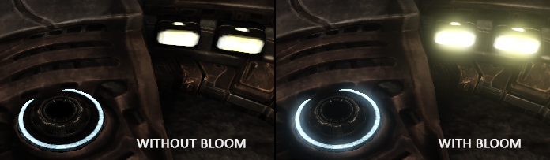
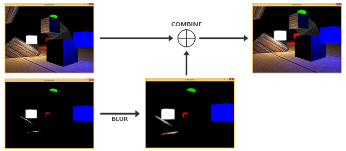

# bloom
为了能够达到light bleed、发光的特效，需要进行一种后处理，这种后处理就叫做泛光。泛光可以达到的效果如图所示:


泛光的实现需要首先渲染三张图片：

    1. 原始的场景图片
    2. 只包含可见光的图片

其中，原始的场景图片作为纹理1，场景的hdr图片进行特殊处理（抛弃掉值小于某个阈值的像素）后得到图片2，再经过模糊后得到纹理2。最后将两个纹理进行混合得到最终图片



## code 
### mutiple render target
为了得到图1和图2，可以使用不同的shader渲染场景两次。但是考虑到两个shader只有fragment shader中的一小部分代码不同，因此可以使用一种trick： MRT(Mutiple Render Targets)。这种方法可以让同一个shader写入多个framebuffer。首先，需要指定fragment shader的输出

```c++
layout (location = 0) out vec4 FragColor;
layout (location = 1) out vec4 BrightColor;
```
然后生成并绑定framebuffer:
```c++
// Set up floating point framebuffer to render scene to
GLuint hdrFBO;
glGenFramebuffers(1, &hdrFBO);
glBindFramebuffer(GL_FRAMEBUFFER, hdrFBO);
GLuint colorBuffers[2];
glGenTextures(2, colorBuffers);
for (GLuint i = 0; i < 2; i++)
{
    glBindTexture(GL_TEXTURE_2D, colorBuffers[i]);
    glTexImage2D(
        GL_TEXTURE_2D, 0, GL_RGB16F, SCR_WIDTH, SCR_HEIGHT, 0, GL_RGB, GL_FLOAT, NULL
    );
    glTexParameteri(GL_TEXTURE_2D, GL_TEXTURE_MIN_FILTER, GL_LINEAR);
    glTexParameteri(GL_TEXTURE_2D, GL_TEXTURE_MAG_FILTER, GL_LINEAR);
    glTexParameteri(GL_TEXTURE_2D, GL_TEXTURE_WRAP_S, GL_CLAMP_TO_EDGE);
    glTexParameteri(GL_TEXTURE_2D, GL_TEXTURE_WRAP_T, GL_CLAMP_TO_EDGE);
    // attach texture to framebuffer
    glFramebufferTexture2D(
        GL_FRAMEBUFFER, GL_COLOR_ATTACHMENT0 + i, GL_TEXTURE_2D, colorBuffers[i], 0
    );
}
```
最后需要显式告知OpenGL我们正在通过glDrawBuffers渲染到多个颜色缓冲，否则OpenGL只会渲染到帧缓冲的第一个颜色附件，而忽略所有其他的。我们可以通过传递多个颜色附件的枚举来做这件事，我们以下面的操作进行渲染：

```c++
GLuint attachments[2] = { GL_COLOR_ATTACHMENT0, GL_COLOR_ATTACHMENT1 };
glDrawBuffers(2, attachments);
```

在片段着色器中，代码如下：

```c++
#version 330 core
layout (location = 0) out vec4 FragColor;
layout (location = 1) out vec4 BrightColor;

    [...]

void main()
{
    [...] // first do normal lighting calculations and output results
    if(brightness > 1.0)
        BrightColor = vec4(result, 1.0);
    else
        BrightColor = vec4(0.0, 0.0, 0.0, 1.0);
    FragColor = vec4(result, 1.0);
}
```

这样colorBuffer[0]存储的纹理就是完整的场景信息， colorBuffer[1]存储的是亮度信息。  


### blur
然后需要得到模糊后的图片，这里在水平和垂直的两个方向上对图片进行高斯模糊
```c++
       bool horizontal = true, first_iteration = true;
        unsigned int amount = 10;
        shaderBlur.Use();
        for (unsigned int i = 0; i < amount; i++)
        {
            glBindFramebuffer(GL_FRAMEBUFFER, pingpongFBO[horizontal]);
            shaderBlur.SetInt("horizontal", horizontal);
            glBindTexture(GL_TEXTURE_2D, first_iteration ? colorBuffers[1] : pingpongColorbuffers[!horizontal]);  // bind texture of other framebuffer (or scene if first iteration)
            renderQuad();
            horizontal = !horizontal;
            if (first_iteration)
                first_iteration = false;
        }
        glBindFramebuffer(GL_FRAMEBUFFER, 0);
```
### render final picture
最后就是混合两个纹理


```c++
#version 330 core
out vec4 FragColor;
in vec2 TexCoords;

uniform sampler2D scene;
uniform sampler2D bloomBlur;
uniform float exposure;

void main()
{             
    const float gamma = 2.2;
    vec3 hdrColor = texture(scene, TexCoords).rgb;      
    vec3 bloomColor = texture(bloomBlur, TexCoords).rgb;
    hdrColor += bloomColor; // additive blending
    // tone mapping
    vec3 result = vec3(1.0) - exp(-hdrColor * exposure);
    // also gamma correct while we're at it       
    result = pow(result, vec3(1.0 / gamma));
    FragColor = vec4(result, 1.0f);
}

```