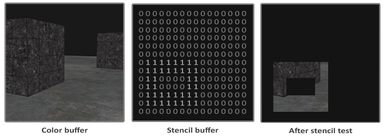
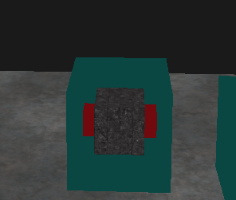

# 深度测试

## depth test function
可以设置深度测试的函数来改变渲染的结果

$$\begin{cases}
a_1x+b_1y+c_1z=d_1\\
a_2x+b_2y+c_2z=d_2\\
a_3x+b_3y+c_3z=d_3\\
\end{cases}
$$

# stencil test （模板测试)

当片段着色器处理完一个片段之后，即获得该像素的值后，不会立刻就写入Render target（back buffer， 也就是存储最后要显示图像的buffer）。此时还会再经历一个阶段，在driectX中被称为output-merge stage(输出合并阶段)，在opengl中，被称为Per-sample processing stage。 模板测试(Stencil Test)和深度测试一样，它也可能会丢弃片段。接下来，**被保留的片段会进入深度测试**，它可能会丢弃更多的片段。模板测试是根据又一个缓冲来进行的，它叫做模板缓冲(Stencil Buffer)，我们可以在渲染的时候更新它来获得一些很有意思的效果。

首先通过一张图来说明模板测试的工作方式：


可以明显看出，只有在stencil buffer为1的时候才会显示该像素的值。


## 启用模板测试

通过glEnable(GL_STENCIL_TEST)可以启用模板测试。
```c
glEnable(GL_STENCIL_TEST);
```

在每次loop中都要清除模板缓存
```c
glClear(GL_STENCIL_BUFFER_BIT);
```

## 如何修改stencil buffer

为了能够修改stencil buffer,需要有两个函数:
1. 通过模板测试的比较函数和采取的措施（这一点和深度测试类似）
2. 写入数据的函数

### 比较函数和采取措施
```c
glStencilFunc(GLenum func, GLint ref, GLuint mask)
```
其中，func为比较方式，可用的选项有：GL_NEVER、GL_LESS、GL_LEQUAL、GL_GREATER、GL_GEQUAL、GL_EQUAL、GL_NOTEQUAL和GL_ALWAYS。它会比较已经存储的stencil buffer上的值和传入的ref.

ref不多赘述。

mask是将ref和stencil buffer上的值与mask按位和，得到的结果s和r，然后再比较两个值。

glStencilOp说明了通过测试后采用的方案。

```c
glStencilOp(GLenum sfail, GLenum dpfail, GLenum dppass)
```
采取的行为：

    sfail：模板测试失败时采取的行为。
    dpfail：模板测试通过，但深度测试失败时采取的行为。
    dppass：模板测试和深度测试都通过时采取的行为。

|行为	|描述|
|-|-|
GL_KEEP	|保持当前储存的模板值
GL_ZERO	|将模板值设置为0
GL_REPLACE	|将模板值设置为glStencilFunc函数设置的ref值
GL_INCR	|如果模板值小于最大值则将模板值加1
GL_INCR_WRAP	|与GL_INCR一样，但如果模板值超过了最大值则归零
GL_DECR	|如果模板值大于最小值则将模板值减1
GL_DECR_WRAP	|与GL_DECR一样，但如果模板值小于0则将其设置为最大值
GL_INVERT	|按位翻转当前的模板缓冲值

### 写入方式
```c++
glStencilMask(0xFF); // 每一位写入模板缓冲时都保持原样
glStencilMask(0x00); // 每一位在写入模板缓冲时都会变成0（禁用写入）
```
使用glStencilMask会在通过模板测试后，将ref和mask按位与后写入stencil buffer中。

应用bitset的思想，可以实现部分渲染的效果。具体看以下例子

## 步骤及举例

```c++
    glEnable(GL_STENCIL_TEST);
    glStencilFunc(GL_NOTEQUAL, 1, 0xFF);
    glStencilOp(GL_KEEP, GL_KEEP, GL_REPLACE);

    ···

    // 在渲染地面时不写入stencil buffer
    glStencilMask(0x00);
    glBindVertexArray(planeVAO);
    glBindTexture(GL_TEXTURE_2D, floorTexture);
    shader.SetMat4("model", glm::mat4(1.0f));
    glDrawArrays(GL_TRIANGLES, 0, 6);
    glBindVertexArray(0);

    // 第一次渲染cube 写入stencil buffer
    glStencilFunc(GL_ALWAYS, 1, 0xFF);
    glStencilMask(0xFF);
    // cubes
    glBindVertexArray(cubeVAO);
    glActiveTexture(GL_TEXTURE0);
    glBindTexture(GL_TEXTURE_2D, cubeTexture);
    model = glm::translate(model, glm::vec3(-1.0f, 0.0f, -1.0f));
    shader.SetMat4("model", model);
    glDrawArrays(GL_TRIANGLES, 0, 36);
    glBindVertexArray(0);

    // 第二次渲染cube 2倍体积 
    // 设置 两倍体积的正方体和原始正方体的差值部分 为3
    glStencilFunc(GL_NOTEQUAL, 3, 0x1);
    glStencilMask(0x0f);
    glDisable(GL_DEPTH_TEST);
    shaderSingleColor.Use();
    float scale = 2.f;
    // cubes
    glBindVertexArray(cubeVAO);
    glBindTexture(GL_TEXTURE_2D, cubeTexture);
    model = glm::mat4(1.0f);
    model = glm::translate(model, glm::vec3(-1.0f, 0.0f, -1.0f));
    model = glm::scale(model, glm::vec3(scale, scale, scale));
    shaderSingleColor.SetMat4("model", model);
    glDrawArrays(GL_TRIANGLES, 0, 36);
    glBindVertexArray(0);

    // 第三次渲染cube 长方体 
    // 在值为3的区域渲染长方体
    glStencilFunc(GL_EQUAL, 2, 0x02);
    glStencilMask(0x0);
    redshader.Use();
    scale = 1.0f;
    // cubes
    glBindVertexArray(cubeVAO);
    glBindTexture(GL_TEXTURE_2D, cubeTexture);
    model = glm::mat4(1.0f);
    model = glm::translate(model, glm::vec3(-1.0f, 0.0f, -1.0f));
    model = glm::scale(model, glm::vec3(1.5f * scale, 0.5f * scale,  0.5f * scale));
    redshader.SetMat4("model", model);
    redshader.SetMat4("view", view);
    redshader.SetMat4("projection", projection);
    glDrawArrays(GL_TRIANGLES, 0, 36);
    glBindVertexArray(0);
```

最后效果图如下：

