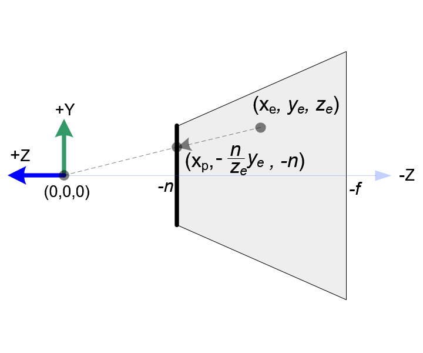

# Projection matrix
本文的目的是进行**投影矩阵M的推导**。

投影变换是把一个frustum中的所有点通过坐标变换压缩到一个正（长）方体中，如图所示：

||
|:-:|
||
|Perspective Frustum and Normalized Device Coordinates (NDC)|

注意：由于相机朝着-z方向，所以后文中使用n和f都是正的，通过加负号表示远近平面的实际坐标。

可写成以下公式：

$$
\tag{1}
\begin{pmatrix}
x_{clip} \\
y_{clip} \\
z_{clip} \\
w_{clip} \\
\end{pmatrix}
 =
\bold{M}_{projection} \cdot 
\begin{pmatrix}
x_e \\
y_e \\
z_e \\
w_e = 1 \\
\end{pmatrix}
$$
在式子(1)中，$(x_e, y_e, z_e, w_e = 1)$为空间中的一点，$(x_{clip}, y_{clip}, z_{clip}, w_{clip})$为单位正方体中的坐标。

整个投影过程可分为两步：
1. 把$p_e$投影到近平面上。
2. 把投影到近平面上的点压缩到一个单位正方体中。

在opengl中，一个在frustum中的点$p_{e}$会被投影到近平面的点$p_{p}$上，如下图所示：

|||
|:-:|:-:|
|||
|Top view of frustum| Side view of frustum |

根据三角形相似，可知$x_p$和$x_e$的关系：
$$

\begin{aligned} 
&\frac{x_p}{x_e} = \frac{-n}{z_e} \\

& x_p = \frac{-n \cdot x_e}{z_e} \\
\end{aligned}
$$
同理：
$$
\begin{aligned}
& \frac{y_p}{y_e} = \frac{-n}{z_e} \\

& y_p = \frac{-n \cdot y_e}{z_e} \\

\end{aligned}
$$

由公式
$$
\tag{2}
\begin{pmatrix}
x_{ndc} \\
y_{ndc} \\
z_{ndc} \\
\end{pmatrix}
=
\begin{pmatrix}
x_{clip} / w_{clip}\\
y_{clip} / w_{clip}\\
z_{clip} / w_{clip}\\
\end{pmatrix}
$$
可知，$(x_{ndc}, y_{ndc}, z_{ndc})$就是$(x_{clip}, y_{clip}, z_{clip}, w_{clip})$。由于$w_{clip}$的值并不影响点$p_{clip}$的位置，我们可以固定设置$w_{clip}$的值为$-z_e$。这样一来，M矩阵的第四行也就固定下来了。

$$
\begin{pmatrix}
x_{clip} \\
y_{clip} \\
z_{clip} \\
w_{clip} \\
\end{pmatrix}
=
\begin{pmatrix}
&\cdots&\cdots&\cdots&\cdots\\
&\cdots&\cdots&\cdots&\cdots\\
&\cdots&\cdots&\cdots&\cdots\\
&0&0&-1&0&\\
\end{pmatrix}
\cdot
\begin{pmatrix}
x_e \\
y_e \\
z_e \\
w_e=1 \\
\end{pmatrix}
$$

由于要把$x_p$坐标从[l, r] 变为 [-1, 1]、,$y_p$的坐标从[b, t] 变为 [-1, 1]。

设$x_{ndc} = k \cdot x_p + b$，将$(x_p = l, x_{ndc} = -1)$和$(x_p = r, x_{ndc} = 1)$带入；
可得：
$$
\begin{cases}
k = &\frac{2}{r-l} \\
b = -&\frac{r+l}{r-l}\\
\end{cases}
$$
最终，$x_{ndc} = \frac{2\cdot x_p}{r-l} - \frac{r+l}{r-l}$,

同理$y_{ndc} = \frac{2\cdot y_p}{t-b} - \frac{t+b}{t-b}$。

用$x_e$和$y_e$代替$x_p$和$y_p$，可得

$$
\begin{aligned}
x_{ndc} &= (\underbrace{\frac{2n}{r-l} \cdot x_e + \frac{r+l}{r-l} * z_e}_{x_{clip}}) / -z_e \\
y_{ndc} &= (\underbrace{\frac{2n}{t-b} \cdot y_e + \frac{t+b}{t-b} * z_e}_{\rm y_{clip}}) / -z_e \\
\end{aligned}
$$

观察到上面式子中括号后的$-z_e$就是$w_{clip}$，由公式(2)可知，括号中的内容即为$x_{clip}$和$y_{clip}$。所以M矩阵的第一二行也可以轻松求出：

$$
\bold{M_{projection}} =
\begin{pmatrix}
&\frac{2n}{r-l}&0&\frac{r+l}{r-l}&0\\
&0&\frac{2n}{t-b}&\frac{t+b}{t-b}&0\\
&\cdots&\cdots&\cdots&\cdots\\
&0&0&-1&0&\\
\end{pmatrix}
$$

由于$z_{clip}$的的值和$x_e$,$y_e$无关，所以第三行的前两列均为0。设后两列的的值分别为A和B，则

$$
z_{ndc} = z_{clip} / w_{clip} = \frac{Az_e + Bw_e}{-z_e}
$$

不妨假设$w_e$为1。将$(z_e = -n, z_{ndc} = -1)$和$(z_e = -f, z_{ndc} = 1)$两组带入。可计算得到:

$$
\begin{cases}
A = &-\frac{f+n}{f-n} \\
B = &-\frac{2fn}{f-n}\\
\end{cases}
$$

最终，M矩阵为
$$
\bold{M_{projection}} =
\begin{pmatrix}
&\frac{2n}{r-l}&0&\frac{r+l}{r-l}&0\\
&0&\frac{2n}{t-b}&\frac{t+b}{t-b}&0\\
&0&0&-\frac{f+n}{f-n}&-\frac{2fn}{f-n}\\
&0&0&-1&0&\\
\end{pmatrix}
$$

注意到$z_{ndc}$和$z_e$并不是线性的关系。
$$
z_{ndc} = \frac{-\frac{f+n}{f-n}z_e - \frac{2fn}{f-n}}{-z_e}
$$

这说明距离近平面越近，$z_{ndc}$的精度就越大

# GAMES101 推导

分为两步：
1. 把视锥“挤压”成一个长方体
2. 再把长方体通过平移和压缩变换转成中心位于原点，棱长为2的正方体

$$
\begin{aligned}
    

M_{projection} &= 
M_{ortho} \cdot M_{p} = 
\begin{pmatrix}
& \frac{2}{r-l} & 0 & 0 & 0 \\
& 0 & \frac{2}{t-b} & 0 & 0 \\
& 0 & 0 & \frac{2}{f-n} & 0 \\
& 0 & 0 & 0 & 1 \\ 
\end{pmatrix}

\times

\begin{pmatrix}
& 1 & 0 & 0 & -\frac{r+l}{2} \\
& 0 & 1 & 0 & -\frac{t+b}{2} \\
& 0 & 0 & 1 & \frac{f+n}{2} \\
& 0 & 0 & 0 & 1 \\ 
\end{pmatrix}

\times

\begin{pmatrix}
& -n & 0 & 0 & 0 \\
& 0 & -n & 0 & 0 \\
& 0 & 0 & -(n+f) & nf \\
& 0 & 0 & 1 & 0 \\ 
\end{pmatrix} \\

& = 
\begin{pmatrix}
    & -\frac{2n}{r-l} & 0 &  -\frac{r+l}{r-l} & 0\\
    & 0 & -\frac{2n}{t-b} & -\frac{t+b}{t-b} & 0 \\
    & 0 & 0 & -\frac{n+f}{f-n} & \frac{2nf}{f-n} \\
    & 0 & 0 & 1 & 0 \\ 
\end{pmatrix}
\end{aligned}
$$
# 结果比较

通过比较发现两个结果只相差了一个符号。由于最后点的实际坐标要除以w分量，所以两个结果是一样的。

但是opengl只接受第一个结果。
